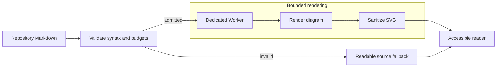
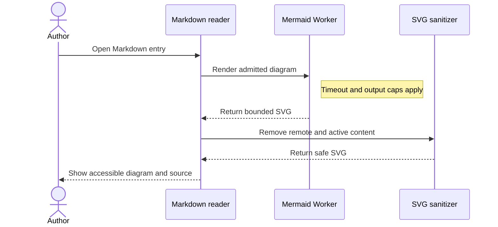

# Markdown Rendering Showcase

This page is a practical rendering check for ordinary, portable Markdown. It combines common authoring patterns with a few deliberate edge cases so the reader can be reviewed in both light and dark themes.

Use the [section link](#links-and-references) to jump to links, open [Atlas Notes](../product/atlas-notes.md) as a regular internal link, or visit the [CommonMark specification](https://spec.commonmark.org/) as an external link.

## Headings And Inline Text

### Third-level heading

#### Fourth-level heading

A paragraph can contain **strong text**, _emphasized text_, **_strong emphasis_**, ~~strikethrough~~, `inline code`, and escaped syntax such as \*literal asterisks\* or \[literal brackets\].

Small technical notation can use safe inline HTML where it remains useful: H<sub>2</sub>O, x<sup>2</sup>, <mark>highlighted text</mark>, and <kbd>⌘</kbd> + <kbd>K</kbd>.

English, 简体中文, 日本語, naïve café, mathematical symbols ∑ and √, and emoji 📝 should share a line without disrupting spacing.

This is a soft line break inside one paragraph.

This line ends with a backslash for a hard break.\
The next sentence should start on a new rendered line.

## Links And References

- Same-page anchor: [Jump to tables](#tables).
- Regular internal link: [Keep Markdown as Source of Truth](../decisions/keep-markdown-as-source-of-truth.md).
- Internal link with a fragment: [Product scope](../product/atlas-notes.md#scope).
- Wikilink: [[architecture/planning-record-architecture]].
- Wikilink with an alias: [[product/atlas-notes|Atlas Notes product direction]].
- Wikilink with a heading and alias: [[guidelines/content-authoring#verification|Content authoring verification]].
- External labelled link: [CommonMark](https://commonmark.org/).
- External autolink: <https://github.github.com/gfm/>.

Inline code keeps link-looking text inert: `[Example](../product/atlas-notes.md)`, `[[product/atlas-notes]]`, and `https://example.com/not-a-link`.

## Lists And Tasks

- Unordered item with a short sentence.
- Unordered item with nested content:
  - Second level item.
  - Another second level item.
    - Third level item with `inline code`.
- Final top-level item.

1. First ordered step.
2. Second ordered step.
   1. Nested ordered step.
   2. Another nested step.
3. Third ordered step.

4. A list can intentionally start at five.
5. Its numbering should continue from there.

- [x] Render a completed task.
- [ ] Render an incomplete task.
- [ ] Preserve **formatting** and [links](../validation/task-board-readiness.md) inside task labels.

## Blockquotes

> Repository Markdown remains the source of truth.
>
> A quote can contain multiple paragraphs, **inline formatting**, and a list:
>
> - A quoted item
> - Another quoted item
>
> > Nested quotes should remain visually distinct without becoming oversized.

## Code

Inline code such as `pnpm --filter @choral-forma/webapp build` should remain legible within prose.

```ts
type RenderState = {
  theme: "light" | "dark";
  sourceOfTruth: "repository-markdown";
};

const state: RenderState = {
  theme: "dark",
  sourceOfTruth: "repository-markdown",
};
```

```rust
fn is_portable(source: &str) -> bool {
    source.ends_with(".md") && !source.contains("hidden-proprietary-store")
}
```

```sh
forma check --json
forma workspace health --json
```

An intentionally long code line should scroll inside its own block instead of widening the whole page:

```text
workspace/validation/markdown-rendering-showcase/this-is-an-intentionally-long-unbroken-value-used-to-confirm-that-code-overflow-remains-local-to-the-code-block-and-does-not-create-page-level-horizontal-scrolling
```

## Diagrams

Mermaid source should become theme-aware diagrams when supported while remaining readable as fenced code when rendering is unavailable. These examples cover a bounded render flow and the corresponding reader-to-Worker interaction without approaching the supported syntax or resource limits.

### Bounded render flow



### Worker rendering sequence



The four sequence participants represent the actual reader boundary rather than an artificial overflow case. Embedded diagrams fit as complete overviews inside the reader at every width. Detailed inspection is available through the keyboard-focusable zoom/pan viewer and its always-visible **Expand diagram** control, which opens a larger canvas with the same controls. The viewer must not widen the page, and captions and source disclosures remain usable outside it.

## Formulae

Inline formulae should share the surrounding baseline naturally, as in $E = mc^2$ and Euler's identity $e^{i\pi} + 1 = 0$.

A display formula should be centered and expose both visual HTML and accessible MathML:

$$
\sum_{i=1}^{n} i = \frac{n(n+1)}{2}
$$

Matrices, roots, fractions, and aligned notation should remain readable:

$$
A =
\begin{bmatrix}
1 & 2 \\
3 & 4
\end{bmatrix},
\qquad
x = \frac{-b \pm \sqrt{b^2 - 4ac}}{2a}
$$

- Formula inside a list item: the circle area is $A = \pi r^2$
- Invalid input remains visible instead of failing the document: $\notARealCommand{x}$.
- Currency stays ordinary text: prices like $5 and $10 are not formulae.
- Escaped delimiters stay ordinary text: \$x\$.
- Inline code stays literal: `$x^2$`.

A deliberately long display formula should scroll inside its own formula region instead of widening the document:

$$
\underbrace{a_1 + a_2 + a_3 + a_4 + a_5 + a_6 + a_7 + a_8 + a_9 + a_{10} + a_{11} + a_{12} + a_{13} + a_{14} + a_{15} + a_{16} + a_{17} + a_{18}}_{\text{local horizontal overflow when the reading column is narrow}}
$$

## Tables

### Compact table

| Feature       |                 Expected behavior                 |     Review |
| :------------ | :-----------------------------------------------: | ---------: |
| Strong text   |            **Rendered with emphasis**             |     Visual |
| Inline code   |                `fields.updatedAt`                 |     Visual |
| Internal link | [Task Board Readiness](./task-board-readiness.md) | Navigation |

### Wide overflow table

This table deliberately exceeds the reading column. It should gain local horizontal scrolling while the document, Outline, and surrounding prose keep their normal width.

| Record | Status | Owner | Reviewer | Source path | Related product | Validation mode | Last updated | Environment | Long diagnostic identifier |
| --- | --- | --- | --- | --- | --- | --- | --- | --- | --- |
| Planning beta readiness | Reviewing | Ava Patel | Noah Kim | `releases/planning-beta.md` | [Atlas Notes](../product/atlas-notes.md) | Link and visual review | 2026-07-23T00:00:00Z | software-product-rd-workspace | `renderer-wide-table-local-overflow-without-document-level-horizontal-scroll-001` |
| Task board projection | Active | Noah Kim | Ava Patel | `.forma/views/task-board.md` | [[product/atlas-notes | Atlas Notes]] | Configured view review | 2026-07-23T00:00:00Z | software-product-rd-workspace | `renderer-wide-table-local-overflow-without-document-level-horizontal-scroll-002` |

### Formatting inside cells

| Plain | Emphasis | Code | Link | Escaped |
| --- | --- | --- | --- | --- |
| Ordinary text | **Strong** and _emphasis_ | `status: active` | [Validation](./release-scope-review.md) | \| literal pipe |
| Inline formula | $x^2 + y^2 = z^2$ | `$x$` | [Formulae](#formulae) | \$5 |

## Local Image

The image below is stored inside this example workspace and uses an ordinary relative Markdown path.


## Native HTML

<details>
<summary>Expandable rendering note</summary>

This content starts collapsed and uses the browser-native `details` element. It contains **Markdown formatting**, a [local link](../guidelines/workspace-operations.md), and `inline code`.

</details>

## Separators And Special Characters

The following horizontal rule should divide this section without looking like an input border.

---

Reserved characters should remain readable when written as text: `&`, `<`, `>`, `"quotes"`, `'apostrophes'`, `{braces}`, `[brackets]`, and `(parentheses)`.

A long unbroken token should wrap or stay locally contained rather than widening the document: `markdown-rendering-showcase-long-unbroken-token-abcdefghijklmnopqrstuvwxyz-0123456789-ABCDEFGHIJKLMNOPQRSTUVWXYZ`.

## Review Checklist

- [ ] Headings appear in the Outline and anchor navigation lands on the correct section.
- [ ] Internal links stay in the app, while external links are visibly distinguishable.
- [ ] Wikilinks resolve and contribute to outgoing links and backlinks.
- [ ] The wide table and long code line scroll locally without page-level horizontal overflow.
- [ ] Both Mermaid diagrams follow the active theme, expose meaningful text alternatives and source disclosures, and show a complete embedded overview without widening the page.
- [ ] At mobile width, **Expand diagram** remains visible and clearly labeled; zoom/pan and the expanded viewer reveal detailed labels, while captions and source disclosures remain usable.
- [ ] Inline, display, invalid, and long formulae remain readable without interpreting currency or code as math.
- [ ] Task items, nested lists, quotes, tables, code, and inline styles remain clear in light and dark themes.
- [ ] The local image stays within the reading column and has meaningful alternative text.
- [ ] The native disclosure opens and closes without application-managed state.
