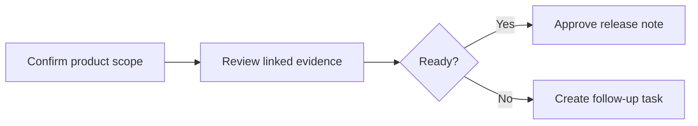

# Rich Content Review Note

This validation note records a normal review of [Atlas Notes](../product/atlas-notes.md). It demonstrates representative Markdown that a product team might keep in its workspace without acting as Forma's renderer regression suite.

## Review Summary

The planning beta remains **ready for focused review**. The team should keep repository Markdown as the source of truth and use `forma check --json` before accepting release evidence.

- Product scope is documented in [Atlas Notes](../product/atlas-notes.md#scope).
- The architecture follows [[architecture/planning-record-architecture]].
- Release evidence is collected in [[releases/planning-beta]].

> Review notes should remain readable in source form as well as in the WebApp.

## Validation Command

```sh
forma check --json
forma workspace health --json
```

The readiness ratio can be summarized as:

$$
\operatorname{readiness} = \frac{\text{passed checks}}{\text{required checks}}
$$

## Review Flow



## Readiness Snapshot

| Area           | Owner     | Current evidence                         | Review |
| -------------- | --------- | ---------------------------------------- | ------ |
| Product scope  | Ava Patel | [Atlas Notes](../product/atlas-notes.md) | Ready  |
| Delivery board | Noah Kim  | [[validation/task-board-readiness]]      | Review |
| Release scope  | Ava Patel | [[validation/release-scope-review]]      | Ready  |

## Supporting Asset


<details>
<summary>Follow-up note</summary>

If any linked evidence changes, rerun the workspace checks and update the related release record rather than expanding this example into a renderer test catalogue.

</details>
