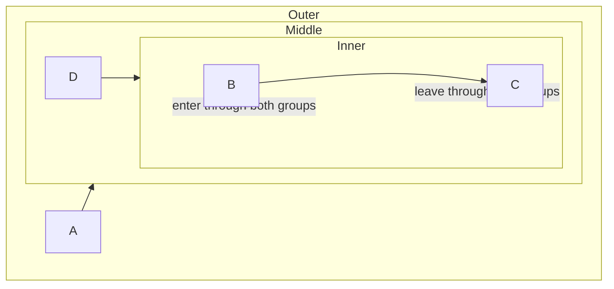
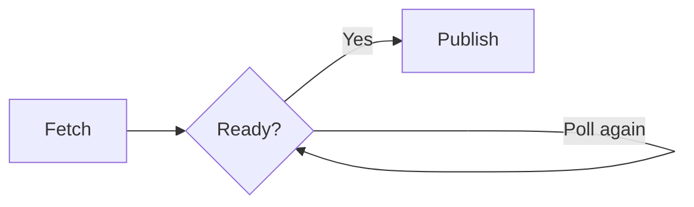
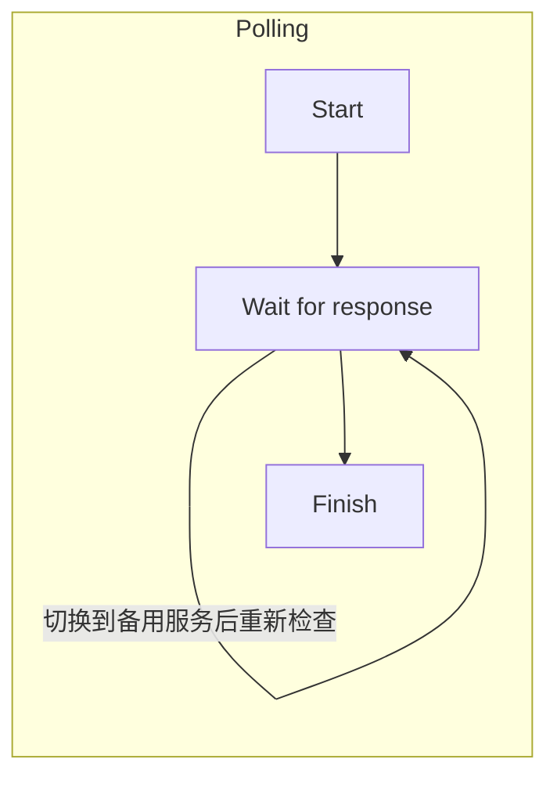
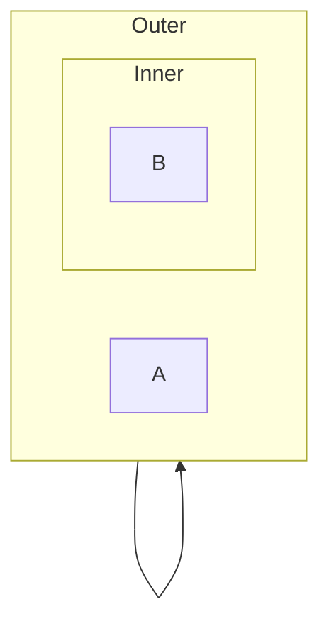

# Mermaid flowchart geometry

## Ancestor edges

```mermaid
flowchart LR
subgraph outer[Outer]
a[A]
subgraph middle[Middle]
subgraph inner[Inner]
b[B] --> c[C]
end
d[D] --> inner
end
end
outer -->|enter through both groups| b
c -->|leave through both groups| outer
a --> middle
```

## Decision self-loop

```mermaid
flowchart LR
Fetch --> Ready{Ready?}
Ready -->|Poll again| Ready
Ready -->|Yes| Publish
```

## Multiple self-loop labels

```mermaid
flowchart LR
subgraph polling[Polling]
Start --> Wait[Wait for response]
Wait -->|Poll again| Wait
Wait -->|Retry after the response times out| Wait
Wait -->|切换到备用服务后重新检查| Wait
Wait --> Finish
end
```

## Subgraph self-loop

```mermaid
flowchart TD
outer --> outer
subgraph outer[Outer]
a[A]
subgraph inner[Inner]
b[B]
end
end
```
