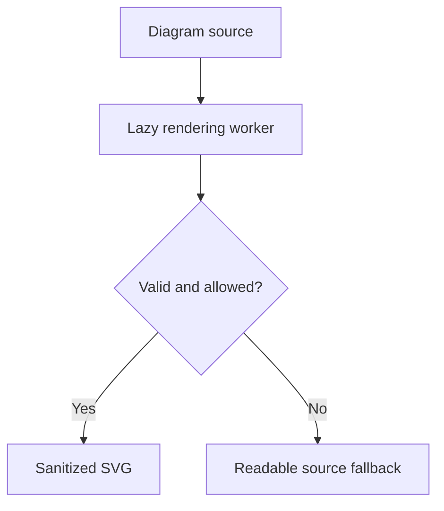

# Diagram Worker and Sanitization Boundary

Mermaid enhancement must remain isolated from Markdown parsing and from other diagrams in the same document.

The full rich-content pressure document is [[samples/reader/markdown-rendering-showcase]].
