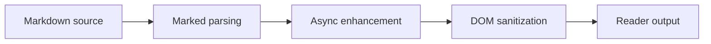
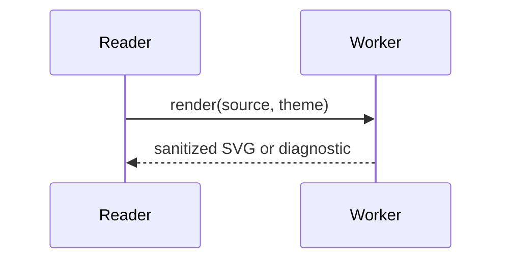
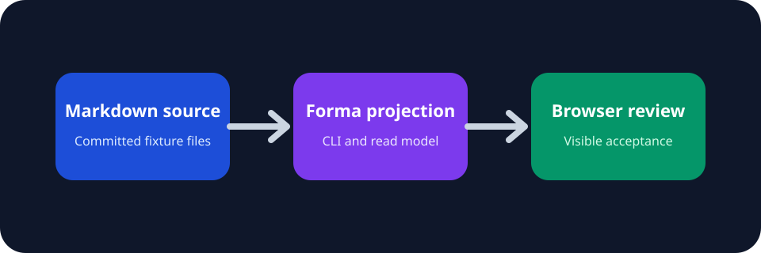

# Markdown Rendering Showcase

This internal sample combines representative Reader features without depending on remote content.

## Heading and Outline Contract

### Repeated Words and Punctuation

Heading ids should remain stable when punctuation, `inline code`, and mixed 中文 text appear.

### Repeated Words and Punctuation

The second repeated heading should receive a distinct anchor rather than colliding with the first.

## Links

- Open [[samples/reader/reference-target]].
- Jump directly to [[samples/reader/reference-target#Fragment Destination]].
- Inspect [[samples/reader/multilingual-long-title]].
- Recognize an external destination such as [Example Domain](https://example.com/) without treating it as a workspace route.

## Lists and Quotes

1. Ordered item with **strong emphasis**.
2. Ordered item with _emphasis_ and `inline code`.
3. Ordered item containing a nested list:
    - first nested value;
    - second nested value.

> A blockquote should preserve readable spacing and contrast in both themes.

## Highlighted Code

```ts
type ValidationResult = {
    assertionId: string;
    passed: boolean;
};

export function summarize(results: ValidationResult[]): string {
    const passed = results.filter((result) => result.passed).length;
    return `${passed}/${results.length} assertions passed`;
}
```

```rust
fn bounded_scale(reference_count: usize) -> f64 {
    1.0 + (reference_count as f64 + 1.0).ln().min(2.5)
}
```

## Math

Inline math: $E = mc^2$.

Block math:

$$
\operatorname{score}(n) = 1 + \min\left(\ln(n + 1), 2.5\right)
$$

## Mermaid Flowchart



## Mermaid Sequence



## Invalid Mermaid Fallback

The following block is intentionally invalid and should fail locally without affecting the valid diagrams:

```mermaid
flowchart TD
    Start["Unclosed node" --> Finish
```

## Wide Markdown Table

| Assertion | Surface | Viewport | Owner | Reviewer | Expected overflow owner | Deliberately long diagnostic value | Result |
| --- | --- | --- | --- | --- | --- | --- | --- |
| READ-005 | Reader | 390 px | Avery Chen | Morgan Lee | Markdown table wrapper | `diagnostic://reader/wide-table/the-content-region-must-scroll-without-expanding-the-application-root` | Pending |
| TABLE-001 | Table | 1440 px | Jordan Rivera | Samira Okafor | Projection table rail | `diagnostic://projection/table/header-and-body-columns-remain-aligned-at-the-rightmost-scroll-position` | Pending |

## Local Media



## Native Disclosure

<details>
<summary>Deterministic evidence note</summary>

This content should remain readable, keyboard operable, and contained by the Reader.

</details>

## Long Token Pressure

`forma-validation://reader/this-is-an-intentionally-unbroken-token-used-to-confirm-that-one-long-value-does-not-expand-the-page-root-beyond-the-current-viewport-boundary-0123456789ABCDEFGHIJKLMNOPQRSTUVWXYZ`

## Relationship Continuation

The diagram policy is expanded in [[samples/projections/diagram-worker-boundary]].
